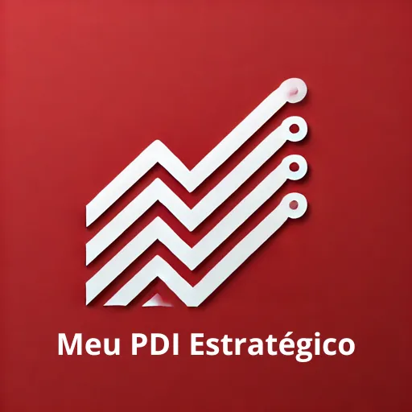

+++
date = '2025-07-29T22:31:50-03:00'
draft = true
title = 'Transformando meu PDI'
+++
Durante anos, encarei o PDI como algo teórico e pouco útil. Preenchia por obrigação, mas nunca via resultado prático. Faltava conexão com meu dia a dia e com o que a empresa realmente precisava.

A virada veio quando percebi que poderia aplicar o modelo de OKRs ao meu próprio desenvolvimento. Alinhei meus objetivos aos da empresa, defini ações concretas e indicadores claros. E, com isso, meu desenvolvimento ganhou direção, propósito e impacto real.

O que facilitou esse processo foi um **assistente inteligente (baseado em GPT).**

O  [**Meu PDI Estratégico](https://chatgpt.com/g/g-67c63ec25c5c8191bd9b92235d814a0c-meu-pdi-estrategico)**   me guiou no passo a passo para:

- Entendimento dos OKRs da empresa
- Definição de objetivos pessoais
- Mapeamento de skills (técnicas e comportamentais)
- Ações práticas e mensuráveis
- Relatório final pronto para usar

Com esse modelo, o PDI deixou de ser burocrático e passou a ser estratégico.

Se você também busca um desenvolvimento conectado com sua carreira e com os objetivos do time, recomendo testar o [**Meu PDI Estratégico](https://chatgpt.com/g/g-67c63ec25c5c8191bd9b92235d814a0c-meu-pdi-estrategico)** que me ajudou nesse processo.

## **Como funciona esse modelo?**

Basicamente, você começa informando seu **contexto profissional**: momento atual, habilidades que deseja desenvolver e seu estilo de trabalho.

A segunda informação importante são os **OKRs do seu time ou da empresa**, que servem como base para alinhar o seu desenvolvimento com os objetivos estratégicos.

A partir disso, o assistente gera uma **sugestão de PDI estruturado**, com:

- **OKR da empresa**
    - *Skills* (hard e soft skills envolvidas)
    - *Plano de ação* (passo a passo prático)
    - *KRs* (indicadores de sucesso do PDI)

As sugestões são personalizáveis: você pode ajustá-las interativamente, e o assistente propõe novas ideias conforme você compartilha oportunidades ou impedimentos do seu contexto.

Por fim, você pode solicitar um **questionário de autoavaliação** e **gerar um relatório completo do seu PDI estratégico** — pronto para uso.

## Por que usar esse modelo?

Transforma o PDI em uma ferramenta estratégica, conectando seu desenvolvimento ao impacto real na empresa.

Com apoio do **[Meu PDI Estratégico](https://chatgpt.com/g/g-67c63ec25c5c8191bd9b92235d814a0c-meu-pdi-estrategico)**, você é guiado de forma clara e prática para:

- Alinhar seu plano aos OKRs da empresa
- Definir ações com foco em skills e resultados
- Acompanhar sua evolução com autoavaliações
- Gerar um relatório pronto para uso profissional

Nada de planos genéricos — é desenvolvimento com propósito e resultado.